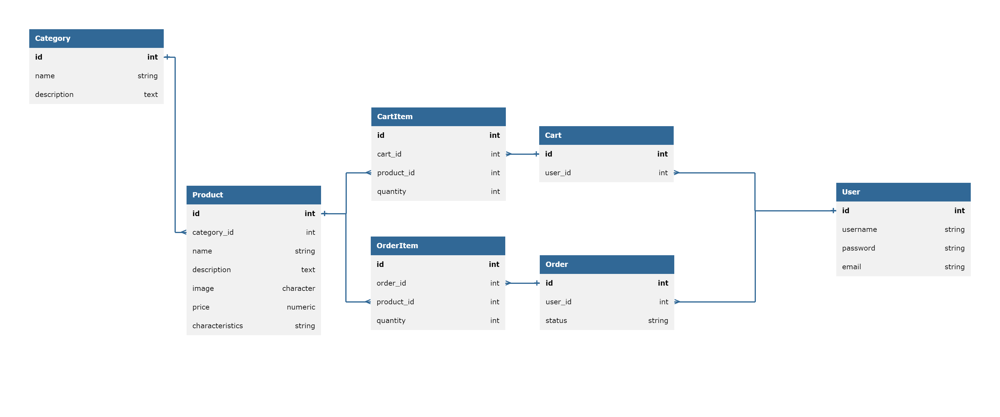

# Интернет-магазин

Backend часть для интернет-магазина. В магазине существует около 100 товарных позиций товаров. Пользователь должен иметь
возможность авторизоваться, посмотреть каталог товаров, добавить товар в корзину и купить его.

## Запуск проекта

1. Выполните клонирование проекта `git clone https://github.com/Wh4tisl0ve/Internet_Shop_DRF.git`
2. Выполните установку зависимостей `poetry install`
3. Создайте базу данных PostgreSQL выполнив SQL скрипт CREATE DATABASE internet_shop
4. Создайте .env файл и заполните переменные окружения
5. Установите актуальное состояние базы данных выполнив `python manage.py migrate`
6. Выполните заполнение базы данных тестовыми данными с помощью `python manage.py seed`
7. Запустите docker-контейнер с
   Minio `docker run -p 9000:9000 -p 9001:9001 --name minio1 -v D:\minio\data:/data -e "MINIO_ROOT_USER=ROOTUSER" -e "MINIO_ROOT_PASSWORD=CHANGEME123" quay.io/minio/minio server /data --console-address ":9001"`
8. Запустите docker-контейнер с MailHog `docker run --name mailhog -p 8025:8025 -p 1025:1025 mailhog/mailhog `
9. Запустите скрипт выполнив `poetry run python manage.py runserver`

## Описание эндпоинтов

* `Get` -> `/products` -> Получение товаров по категории. `query_string` для фильтрации - category_id, min_price,
  max_price.

Пример ответа:

```
[
    {
        "id": 1,
        "name": "Product name",
        "description": "Product desription",
        "image": "http://127.0.0.1:8000/media/products/images/example_36aBTmX.jpg",
        "price": "24.43",
        "characteristics": "Water popular hundred major religious.",
        "category": {
            "id": 10,
            "name": "size",
            "description": null,
            "parent": null
        }
    },
    {
        "id": 2,
        "name": "Product name",
        "description": "Product desription",
        "image": "http://127.0.0.1:8000/media/products/images/example_36aBTmX.jpg",
        "price": "24.43",
        "characteristics": "Water popular hundred major religious.",
        "category": {
            "id": 10,
            "name": "size",
            "description": null,
            "parent": null
        }
    },
]
```

* `Get` -> `/product/1` -> Получение карточки конкретного товара

Пример ответа:

```
{
    "id": 1,
    "name": "Product",
    "description": "Product desription",
    "image": "http://127.0.0.1:8000/media/products/images/example_36aBTmX.jpg",
    "price": "24.43",
    "characteristics": "Water popular hundred major religious.",
    "category": {
        "id": 10,
        "name": "size",
        "description": null,
        "parent": null
    }
}
```

* `GET` -> `/categories ` -> Возвращение списка категорий. У категорий может быть несколько уровней вложенности.

Пример ответа:

```
[
    {
        "id": 1,
        "name": "Root Category",
        "description": null,
        "children": [
            {
                "id": 2,
                "name": "New Subcategory",
                "description": "This is a new subcategory",
                "children": []
            }
        ]
    },
    {
        "id": 2,
        "name": "New Subcategory",
        "description": "This is a new subcategory",
        "children": []
    }
]
```

* `GET`, `POST` -> `/cart/items/` -> Получение\Добавление товаров в корзине.
  Данный метод доступен только авторизованным пользователям.
  Для получения информации по регистрации/авторизации перейдите к пункту "Работа с пользователями"

Пример ответа на `GET` запрос:

```
[
    {
        "product": 2,
        "quantity": 4
    },
    {
        "product": 2,
        "quantity": 4
    },
    {
        "product": 2,
        "quantity": 4
    },
    {
        "product": 2,
        "quantity": 4
    },
    {
        "product": 9,
        "quantity": 5
    }
]
```

Пример `POST` запроса:

```
{
    "product": 1,
    "quantity": 8
}
```

Пример ответа на `POST` запрос:

```
{
    "product": 1,
    "quantity": 8
}
```

* `GET`, `PUT`, `DELETE` -> `/cart/items/1/` -> Работа с конкретным товаром в корзине.
  Данный метод доступен только авторизованным пользователям.

Пример запроса для работы с конкретным товаром:

```
{
    "id": 1,
    "quantity": 4,
    "product": 2
}
```

* `POST` -> `/order/` -> Создание заказа. После вызова эндпоинта происходит очистка корзины и отправка уведомления на
  почту.
  Данный метод доступен только авторизованным пользователям.

Пример ответа:

```
{
    "order": {
        "id": 38,
        "items": [
            {
                "id": 30,
                "quantity": 4,
                "order": 38,
                "product": 2
            },
            {
                "id": 31,
                "quantity": 4,
                "order": 38,
                "product": 2
            },
            {
                "id": 32,
                "quantity": 4,
                "order": 38,
                "product": 2
            },
            {
                "id": 33,
                "quantity": 4,
                "order": 38,
                "product": 2
            },
            {
                "id": 34,
                "quantity": 5,
                "order": 38,
                "product": 9
            }
        ]
    }
}
```

### Работа с пользователями

* `POST` -> `/accounts/register/` - Регистрация нового пользователя. Обязательные поля - username, password.

Пример ответа:

```
{
    "id": 1,
    "username": "Test",
    "email": "",
    "first_name": "",
    "last_name": ""
}
```

* `POST` -> `/accounts/login/` - Авторизация пользователя. Обязательные поля - username, password.
  Был SessionAuthentication, предоставляемый Django REST Framework, который использует сессии Django для аутентификации
  пользователей.

Пример запроса:

```
{
    "username": "Test",
    "password": "Password"
}
```

Пример ответа:

```
{
    "detail": "Login successful"
}
```

* `POST` -> `/accounts/logout/` - Выход из системы. При отправке `Post` запроса произойдет выход из системы и удаление
  сессии.

## База данных(структура)

В качестве системы управления базами данных была выбрана PostgreSQL.
Для управления объектами бд была использована Django ORM.
База данных содержит в себе 7 таблиц:

1. `Category` - таблица, содержащая информацию о категориях магазина.
2. `Product` - таблица, содержащая информацию о продуктах магазина.
3. `CartItem` - таблица, содержащая информацию о содержимом корзины.
4. `OrderItem` - таблица, содержащая информацию о содержимом заказа.
5. `Order` - таблица, содержащая информацию о корзине и её владельце.
6. `Cart` - таблица, содержащая информацию о заказе и заказчике.
7. `User` - таблица, содержащая информацию о пользователях системы.



## Стек

* Python 3.12
* Poetry
* Django Rest Framework
* PostgreSQL
* MailHog для локального тестирования SMTP-сервера
* Minio S3 для хранения изображений товаров
